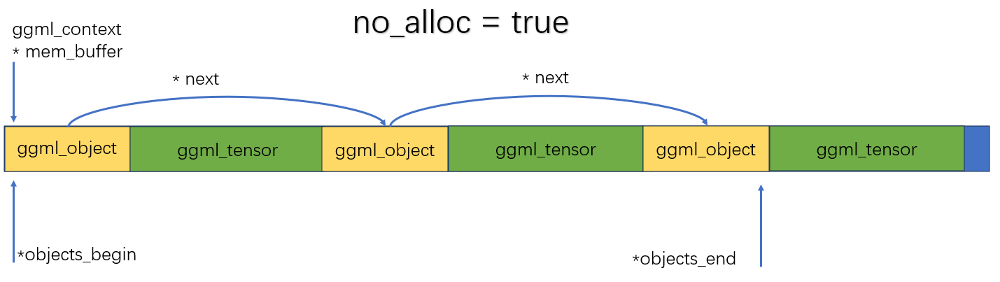

# 源码解读

## 核心数据结构

### ggml_object

```c
struct ggml_object {
    size_t offs;
    size_t size;

    struct ggml_object * next;

    enum ggml_object_type type;

    char padding[4];
};
```

`offs`：这个object的**数据**在`mem_buffer`中的字节偏移量，为什么会有32的偏移，object这个结构体相当于一个头，这个头是占了32个字节。
`size`：这个object占用的字节数
`next`：单向链表，指向的下一个object
`type`：枚举类型，主要有三种`TENSOR`、`GRAPH`和`WORK_BUFFER`

这里的`ggml_object`本身也存在ctx的`mem_buffer`里

### ggml_context

ggml_context是一个上下文管理结构体

```c
struct ggml_context {
    size_t mem_size;
    void * mem_buffer;
    bool   mem_buffer_owned;
    bool   no_alloc;

    int    n_objects;

    struct ggml_object * objects_begin;
    struct ggml_object * objects_end;
};
```
ggml_context本质是一个线性内存池的管理器，这里面称为`arena allocatgor`，是一个控制头。

`mem_size`：是表示内存池的总大小（多少个字节），表示的是`mem_buffer`这片大内存的总容量上限

`mem_buffer`：是这块大内存的起始地址，一大块连续大内存，这块内存存放的是：`ggml_object`、`ggml_tensor`等等

`mem_buffer_owned`：这块内存是不是该ctx拥有的，如果说我声明一个ctx，没有给他分配内存，是ctx自己malloc的，那就有拥有权，如果指定了一个地址，那就没有拥有权。**拥有权在于允不允许ggml来释放**

`no_alloc`：如果是false，表示新建张量的时候，tensor的元数据+数据本身都分配在mem_buffer中，如果是true，那就是只在mem_buffer中存ggml_tensor的结构体，数据部分不去分配，数据可能要分配到后端上（目前是这样）

`n_object`：整个ctx就是一个链表，这个就是链表节点数

`objects_begin`：链表头节点

`objects_end`：链表尾节点


### 理解整个ctx



如果不进行alloc，那整个ctx保留的就是元数据，这种方式让实际数据的存储与后端剥离开，不会先分配到内存中


### ggml_opt_dataset

ggml_opt_dataset是最新版里面，用来初始化数据集的。

这里面有一个context，


### ggml_backend_buffer


### ggml_tensor


## mnist-eval.cpp

```cpp
    ggml_opt_dataset_t result = new ggml_opt_dataset;
    result->ndata       = ndata;
    result->ndata_shard = ndata_shard;

    {
        struct ggml_init_params params = {
            /*.mem_size   =*/ 2*ggml_tensor_overhead(),
            /*.mem_buffer =*/ nullptr,
            /*.no_alloc   =*/ true,
        };
        result->ctx = ggml_init(params);
    }

```

是去申请ggml_context，这个context你可以理解为一个ggml_obj的一个内存池，以链表的形式去存一个个的ggml_obj的对象

object有三种：tensor、graph和buffer

前面是把ggml_init给init好了

ggml_new_tensor_2d，是去申请context里面的data，这个data就是提前开辟好的内存

get_tensor的过程中`ggml_new_tensor_impl`，是返回ggml_tensor，主要做的工作是new一个ggml的object，可以看一下这个object，`static struct ggml_object * ggml_new_object(struct ggml_context * ctx, enum ggml_object_type type, size_t size)`

