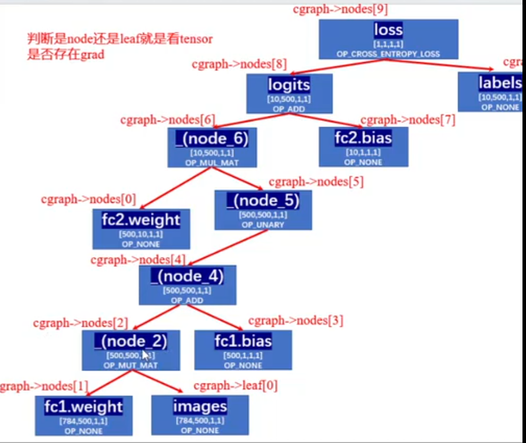

[TOC]

# 源码解读

## 核心数据结构

### ggml_object

```c
struct ggml_object {
    size_t offs;
    size_t size;

    struct ggml_object * next;

    enum ggml_object_type type;

    char padding[4];
};
```

`offs`：这个object的**数据**在`mem_buffer`中的字节偏移量，为什么会有32的偏移，object这个结构体相当于一个头，这个头是占了32个字节。
`size`：这个object占用的字节数
`next`：单向链表，指向的下一个object
`type`：枚举类型，主要有三种`TENSOR`、`GRAPH`和`WORK_BUFFER`

这里的`ggml_object`本身也存在ctx的`mem_buffer`里

### ggml_context

ggml_context是一个上下文管理结构体

```c
struct ggml_context {
    size_t mem_size;
    void * mem_buffer;
    bool   mem_buffer_owned;
    bool   no_alloc;

    int    n_objects;

    struct ggml_object * objects_begin;
    struct ggml_object * objects_end;
};
```
ggml_context本质是一个线性内存池的管理器，这里面称为`arena allocator`，是一个控制头。

`mem_size`：是表示内存池的总大小（多少个字节），表示的是`mem_buffer`这片大内存的总容量上限

`mem_buffer`：是这块大内存的起始地址，一大块连续大内存，这块内存存放的是：`ggml_object`、`ggml_tensor`等等

`mem_buffer_owned`：这块内存是不是该ctx拥有的，如果说我声明一个ctx，没有给他分配内存，是ctx自己malloc的，那就有拥有权，如果指定了一个地址，那就没有拥有权。**拥有权在于允不允许ggml来释放**

`no_alloc`：如果是false，表示新建张量的时候，tensor的元数据+数据本身都分配在mem_buffer中，如果是true，那就是只在mem_buffer中存ggml_tensor的结构体，数据部分不去分配，数据可能要分配到后端上（目前是这样）

`n_object`：整个ctx就是一个链表，这个就是链表节点数

`objects_begin`：链表头节点

`objects_end`：链表尾节点


#### 理解整个ctx


如果不进行alloc，那整个ctx保留的就是元数据，这种方式让实际数据的存储与后端剥离开，不会先分配到内存中

### ggml_tensor

```c
struct ggml_tensor {
    enum ggml_type type;

    struct ggml_backend_buffer * buffer;

    int64_t ne[GGML_MAX_DIMS]; // number of elements
    size_t  nb[GGML_MAX_DIMS]; // stride in bytes:
                                // nb[0] = ggml_type_size(type)
                                // nb[1] = nb[0]   * (ne[0] / ggml_blck_size(type)) + padding
                                // nb[i] = nb[i-1] * ne[i-1]

    // compute data
    enum ggml_op op;

    // op params - allocated as int32_t for alignment
    int32_t op_params[GGML_MAX_OP_PARAMS / sizeof(int32_t)];

    int32_t flags;

    struct ggml_tensor * src[GGML_MAX_SRC];

    // source tensor and offset for views
    struct ggml_tensor * view_src;
    size_t               view_offs;

    void * data;

    char name[GGML_MAX_NAME];

    void * extra; // extra things e.g. for ggml-cuda.cu

    char padding[8];
};
```

`type`：指的是数据的元素类型，决定的是每个元素占用多少字节
`buffer`：tensor指向的后端存储区
`ne`：number of element，指的是形状（一般是列、行，第三维，第四维）
`nb`：number of Bytes，每个维度存多少个字节，这个是方便stride的，方便求地址用
`ggml_op`：就是算子类型
`op_params`：运算参数


### ggml_cgraph

```c
struct ggml_cgraph {
    int size;    // maximum number of nodes/leafs/grads/grad_accs
    int n_nodes; // number of nodes currently in use
    int n_leafs; // number of leafs currently in use

    struct ggml_tensor ** nodes;     // tensors with data that can change if the graph is evaluated
    struct ggml_tensor ** grads;     // the outputs of these tensors are the gradients of the nodes
    struct ggml_tensor ** grad_accs; // accumulators for node gradients
    struct ggml_tensor ** leafs;     // tensors with constant data
    int32_t             * use_counts;// number of uses of each tensor, indexed by hash table slot

    struct ggml_hash_set visited_hash_set;

    enum ggml_cgraph_eval_order order;

    // an optional identifier that can be utilized to recognize same graphs if two non-zero values match
    // a value of 0 means it is not set and should be ignored
    uint64_t uid;
};

```

`n_nodes`：节点数
`n_leafs`：叶子数
`nodes`：需要计算的张量（中间结果）
`grads`：对应梯度（用于反向传播）
`grad_accs`：梯度累计器
`leafs`：常量/输入/权重
`use_counts`：每个节点的引用计数

`visited_hash_set`：去重哈希表
`order`：求值顺序
`uid`：可选唯一标识


### ggml_backend_buffer

这个就是把数据实际存储到了该后端上

```c
struct ggml_backend_buffer {
    struct ggml_backend_buffer_i  iface;
    ggml_backend_buffer_type_t    buft;
    void * context;
    size_t size;
    enum ggml_backend_buffer_usage usage;
};
```

`ggml_backend_buffer_i`：这里面保存的是虚函数表，是一组虚函数指针，去定义这块内存怎么读写，是为了适配不同后端（CPU/CUDA/Metal）填入不同的函数实现，上层的代码去统一调用

`buft`：记录自己是哪种类型的buffer，用来查询对齐要求、名称等元信息

`context`：后端私有数据

`size`：这块buffer的总字节数

`usage`：用途标记


#### ggml_backend_buffer_i

```c
struct ggml_backend_buffer_i {
    // 释放底层内存
    void         (*free_buffer)  (ggml_backend_buffer_t buffer);
    // 返回内存起始地址
    void *       (*get_base)     (ggml_backend_buffer_t buffer);
    // 将tensor注册到buffer
    enum ggml_status (*init_tensor)(ggml_backend_buffer_t buffer, struct ggml_tensor * tensor);
    // 对tensor数据区清零
    void         (*memset_tensor)(ggml_backend_buffer_t buffer, struct ggml_tensor * tensor, uint8_t value, size_t offset, size_t size);
    // 把CPU数据写入buffer
    void         (*set_tensor)   (ggml_backend_buffer_t buffer, struct ggml_tensor * tensor, const void * data, size_t offset, size_t size);
    // 从buffer读取数据返回cpu
    void         (*get_tensor)   (ggml_backend_buffer_t buffer, const struct ggml_tensor * tensor, void * data, size_t offset, size_t size);
    // (optional) 2d data copies
    void         (*set_tensor_2d)(...);
    void         (*get_tensor_2d)(...);
    // (optional) tensor copy between backends
    bool         (*cpy_tensor)   (ggml_backend_buffer_t buffer, const struct ggml_tensor * src, struct ggml_tensor * dst);
    // 整块buffer清零
    void         (*clear)        (ggml_backend_buffer_t buffer, uint8_t value);
    // (optional) reset any internal state
    void         (*reset)        (ggml_backend_buffer_t buffer);
};
```


#### 进一步理解


### ggml_tallocr

```cpp
struct ggml_tallocr {
    ggml_backend_buffer_t buffer;
    void * base;
    size_t alignment;
    size_t offset;
};
```

tensor不是没有具体指向后端的buffer，通过ggml_tallocr来将tensor的data变量指向buffer


### ggml_gallocr

``` c
struct ggml_gallocr {
    ggml_backend_buffer_type_t * bufts; // [n_buffers]
    struct vbuffer ** buffers; // [n_buffers]
    struct ggml_dyn_tallocr ** buf_tallocs; // [n_buffers]
    int n_buffers;

    struct ggml_hash_set hash_set;
    struct hash_node * hash_values; // [hash_set.size]

    struct node_alloc * node_allocs; // [n_nodes]
    int n_nodes;

    struct leaf_alloc * leaf_allocs; // [n_leafs]
    int n_leafs;
};
```

`bufts`：指向一个数组，这个数组存储了不同的缓冲区类型。每一个缓冲区类型对应一种后端（CPU/GPU）
`buffers`：实际的缓冲区指针，N_buffers个缓冲区指针
`n_buffers`：就是一共多少个缓冲区
`buf_tallocs`：也是n个，这个存储的是动态张量分配器的指针，分配器去负责管理对应缓冲区中的张量分配
`hash_set`：用于存储和快速查找张量的哈希表，哈希表用来记录张量的使用情况，避免重复分配和管理张量
`hash_values`：指向一个数组，数组存储哈希表中的节点
`node_allocs`：指向一个数组，数组存储了计算图中每个节点的分配信息，每个节点表示一个操作或张量
`n_nodes`：节点的个数
`leaf_alloc`：指向一个数组，数组存储了计算图每个叶子节点的分配信息，每个节点表示一个操作或张量
`n_leafs`：叶子节点个数

### ggml_opt_dataset

ggml_opt_dataset是最新版里面，用来初始化数据集的。

```c
struct ggml_opt_dataset {
    struct ggml_context   * ctx    = nullptr;
    ggml_backend_buffer_t   buf    = nullptr;
    struct ggml_tensor    * data   = nullptr;
    struct ggml_tensor    * labels = nullptr;

    int64_t ndata       = -1;
    int64_t ndata_shard = -1;
    size_t  nbs_data    = -1;
    size_t  nbs_labels  = -1;

    std::vector<int64_t> permutation;
};
```

`ggml_context`：内存池管理器
`ggml_backend_buffer_t`：后端存储
`ggml_tensor`：数据tensor
`ggml_tensor`：标签tensor


### mnist_model

对于mnist的demo来讲，这是一个关键的模型结构体

```c
struct mnist_model {
    std::string arch;   // "fc"或者"cnn"，决定是用哪套权重
    ggml_backend_sched_t backend_sched; // 后端调度器
    std::vector<ggml_backend_t> backends;   // 可用后端列表
    const int nbatch_logical;   // 逻辑batch_size，逻辑上来讲就是我们希望一次用多少个样本
    const int nbatch_physical;  // 物理batch_size，物理上就是实际硬件并行计算多少个样本

    struct ggml_tensor * images     = nullptr;  // 每次输入的一批图像tensor指针
    struct ggml_tensor * logits     = nullptr;  // 模型输出的得分指针

    // 权重信息
    struct ggml_tensor * fc1_weight = nullptr;  
    struct ggml_tensor * fc1_bias   = nullptr;
    struct ggml_tensor * fc2_weight = nullptr;
    struct ggml_tensor * fc2_bias   = nullptr;

    // 这个是如果使用cnn来推理，那就是这套指针
    struct ggml_tensor * conv1_kernel = nullptr;
    struct ggml_tensor * conv1_bias   = nullptr;
    struct ggml_tensor * conv2_kernel = nullptr;
    struct ggml_tensor * conv2_bias   = nullptr;
    struct ggml_tensor * dense_weight = nullptr;
    struct ggml_tensor * dense_bias   = nullptr;

    // 重要的上下文管理
    struct ggml_context * ctx_gguf    = nullptr;        // 权重上下文管理
    struct ggml_context * ctx_static  = nullptr;        // 存储静态权重tensor的元数据
    struct ggml_context * ctx_compute = nullptr;        // 存计算图中间节点
    ggml_backend_buffer_t buf_gguf    = nullptr;        // ctx_gguf对应的后端存储
    ggml_backend_buffer_t buf_static  = nullptr;        // ctx_static的后端存储
```

### gguf_context

```c
struct gguf_context {
    uint32_t version = GGUF_VERSION;

    std::vector<struct gguf_kv> kv;
    std::vector<struct gguf_tensor_info> info;

    size_t alignment = GGUF_DEFAULT_ALIGNMENT;
    size_t offset    = 0; // offset of `data` from beginning of file
    size_t size      = 0; // size of `data` in bytes

    void * data = nullptr;
};
```


n_kv n_tensors 学习一下gguf的具体格式

### ggml_backend_reg

```cpp
struct ggml_backend_reg {
    int api_version; // initialize to GGML_BACKEND_API_VERSION
    struct ggml_backend_reg_i iface;
    void * context;
};
```

这应该是一个标明后端的结构，主要是声明后端的一些情况，有一些虚函数可以使用

### ggml_backend_device

```cpp
struct ggml_backend_device {
    struct ggml_backend_device_i iface;
    ggml_backend_reg_t reg;
    void * context;
};
```

device也是同理的，我们有很多device的接口，它对应的reg的地址，也就是跟ggml_backend_reg对应起来的，再一个就是context

```cpp
struct ggml_backend_device_i {
        // device name: short identifier for this device, such as "CPU" or "CUDA0"
        const char * (*get_name)(ggml_backend_dev_t dev);

        // device description: short informative description of the device, could be the model name
        const char * (*get_description)(ggml_backend_dev_t dev);

        // device memory in bytes: 0 bytes to indicate no memory to report
        void         (*get_memory)(ggml_backend_dev_t dev, size_t * free, size_t * total);

        // device type
        enum ggml_backend_dev_type (*get_type)(ggml_backend_dev_t dev);

        // device properties
        void (*get_props)(ggml_backend_dev_t dev, struct ggml_backend_dev_props * props);

        // backend (stream) initialization
        ggml_backend_t (*init_backend)(ggml_backend_dev_t dev, const char * params);

        // preferred buffer type
        ggml_backend_buffer_type_t (*get_buffer_type)(ggml_backend_dev_t dev);

        // (optional) host buffer type (in system memory, typically this is a pinned memory buffer for faster transfers between host and device)
        ggml_backend_buffer_type_t (*get_host_buffer_type)(ggml_backend_dev_t dev);

        // (optional) buffer from pointer: create a buffer from a host pointer (useful for memory mapped models and importing data from other libraries)
        ggml_backend_buffer_t (*buffer_from_host_ptr)(ggml_backend_dev_t dev, void * ptr, size_t size, size_t max_tensor_size);

        // check if the backend can compute an operation
        bool (*supports_op)(ggml_backend_dev_t dev, const struct ggml_tensor * op);

        // check if the backend can use tensors allocated in a buffer type
        bool (*supports_buft)(ggml_backend_dev_t dev, ggml_backend_buffer_type_t buft);

        // (optional) check if the backend wants to run an operation, even if the weights are allocated in an incompatible buffer
        // these should be expensive operations that may benefit from running on this backend instead of the CPU backend
        bool (*offload_op)(ggml_backend_dev_t dev, const struct ggml_tensor * op);

        // (optional) event synchronization
        ggml_backend_event_t (*event_new)         (ggml_backend_dev_t dev);
        void                 (*event_free)        (ggml_backend_dev_t dev, ggml_backend_event_t event);
        void                 (*event_synchronize) (ggml_backend_dev_t dev, ggml_backend_event_t event);
    };
```

这张虚函数表还是很关键的，我们一层层来看

如果是以cpu为例，`ggml_backend_cpu_device_init_backend`返回的是cpu的init，这就是具体的函数了，用虚函数表来实现运行时的多态


### ggml_backend_cpu_context

```cpp
struct ggml_backend_cpu_context {
    int                 n_threads;
    ggml_threadpool_t   threadpool;

    uint8_t *           work_data;
    size_t              work_size;

    ggml_abort_callback abort_callback;
    void *              abort_callback_data;

    bool                use_ref;  // use reference implementation
};
```

这是cpu后端的上下文类，我们这里主要声明线程数量、线程池、数据、数据量

GGML_DEFAULT_N_THREADS的默认线程数量是4

### ggml_backend

```cpp
struct ggml_backend {
    ggml_guid_t guid;
    struct ggml_backend_i iface;
    ggml_backend_dev_t device;
    void * context;
};
```

### ggml_backend_sched

```cpp
struct ggml_backend_sched {
    bool is_reset; // true if the scheduler has been reset since the last graph split
    bool is_alloc;

    int n_backends;

    ggml_backend_t backends[GGML_SCHED_MAX_BACKENDS];
    ggml_backend_buffer_type_t bufts[GGML_SCHED_MAX_BACKENDS];
    ggml_gallocr_t galloc;

    // hash map of the nodes in the graph
    struct ggml_hash_set  hash_set;
    int                 * hv_tensor_backend_ids; // [hash_set.size]
    struct ggml_tensor ** hv_tensor_copies;      // [hash_set.size][n_backends][n_copies]

    int * node_backend_ids; // [graph_size]
    int * leaf_backend_ids; // [graph_size]

    int * prev_node_backend_ids; // [graph_size]
    int * prev_leaf_backend_ids; // [graph_size]

    // copy of the graph with modified inputs
    struct ggml_cgraph graph;

    // graph splits
    struct ggml_backend_sched_split * splits;
    int n_splits;
    int splits_capacity;

    // pipeline parallelism support
    int n_copies;
    int cur_copy;
    int next_copy;
    ggml_backend_event_t events[GGML_SCHED_MAX_BACKENDS][GGML_SCHED_MAX_COPIES];
    struct ggml_tensor * graph_inputs[GGML_SCHED_MAX_SPLIT_INPUTS];
    int n_graph_inputs;

    struct ggml_context * ctx;

    ggml_backend_sched_eval_callback callback_eval;
    void * callback_eval_user_data;

    char * context_buffer;
    size_t context_buffer_size;

    bool op_offload;

    int debug;

    // used for debugging graph reallocations [GGML_SCHED_DEBUG_REALLOC]
    // ref: https://github.com/ggml-org/llama.cpp/pull/17617
    int debug_realloc;
    int debug_graph_size;
    int debug_prev_graph_size;
};

```

## 数据集构建

### ggml_init

首先就是走`ggml_opt_dataset_init`这个函数，进行初始化，这里上来是一个参数的初始化，也就是ggml_init_params params = {}; 这里为什么是`ggml_tensor_overhead()`，看到这个里面就是返回两个结构体的元数据大小，也就是`ggml_object`的size，是32，`ggml_tensor`的size，是336。乘以二刚好就是输入数据和数据标签两个ggml_object的大小，把这个参数送到ggml_init进行初始化。
```cpp
    ggml_opt_dataset_t result = new ggml_opt_dataset;
    result->ndata       = ndata;
    result->ndata_shard = ndata_shard;

    {
        struct ggml_init_params params = {
            /*.mem_size   =*/ 2*ggml_tensor_overhead(),
            /*.mem_buffer =*/ nullptr,
            /*.no_alloc   =*/ true,
        };
        result->ctx = ggml_init(params);
    }

```

往下来底层走的是一个`ggml_malloc`，sizeof(ctx)是40。

`GGML_PAD(params.mem_size, GGML_MEM_ALIGN)`会进行一个内存对齐的内存申请，这块就是申请两个`ggml_object` + `ggml_tensor`的结构体，因为我们是no_alloc的，所以不会在ctx中保存数据信息

这样context这个数据结构就定义好了，下一步是生成具体的tensor结构体。

### ggml_new_tensor_impl

这个很好理解，就是去把具体的ctx中的obj和tensor定义好，但是这一步仅仅是声明了元数据，包括tensor的ne、nb，维护好了ctx这个链表，但是具体的数据buf还没有维护好

### ggml_backend_alloc_ctx_tensors_from_buft

这个是分配到具体后端上的内存

## 模型构建

在模型构建过程中我们维护第二个`gguf_context`

## 计算图构建

### 矩阵乘法算子构建

```c
struct ggml_tensor * ggml_mul_mat(
        struct ggml_context * ctx,
        struct ggml_tensor  * a,
        struct ggml_tensor  * b) {
    GGML_ASSERT(ggml_can_mul_mat(a, b));
    GGML_ASSERT(!ggml_is_transposed(a));

    const int64_t ne[4] = { a->ne[1], b->ne[1], b->ne[2], b->ne[3] };
    struct ggml_tensor * result = ggml_new_tensor(ctx, GGML_TYPE_F32, 4, ne);

    result->op     = GGML_OP_MUL_MAT;
    result->src[0] = a;
    result->src[1] = b;

    return result;
}
```



## 模型推理


# GPT-batched

## 数据结构

### gpt_params

```cpp
struct gpt_params {
    int32_t seed         = -1;   // RNG seed    随机种子，那就是随机种子
    int32_t n_threads    = std::min(4, (int32_t) std::thread::hardware_concurrency());      // 线程数，CPU并行计算的值，如果后端加速采用cpu，那这个变量有效
    int32_t n_predict    = 200;  // new tokens to predict   这个是自回归生成的token数量
    int32_t n_parallel   = 1;    // number of parallel streams  并行序列的数量，共享prompt的KVCache
    int32_t n_batch      = 32;   // batch size for prompt processing 批大小
    int32_t n_ctx        = 2048; // context size (this is the KV cache max size) 上下文窗口大小，KV Cache能够容纳的最大的token数量（上下文窗口上限）
    int32_t n_gpu_layers = 0;    // number of layers to offlload to the GPU 针对GPU，卸载到GPU的层数

    bool ignore_eos = false; // ignore EOS token when generating text 

    // sampling parameters
    int32_t top_k          = 40;
    float   top_p          = 0.9f;
    float   temp           = 0.9f;
    int32_t repeat_last_n  = 64;
    float   repeat_penalty = 1.00f;

    std::string model      = "models/gpt-2-117M/ggml-model.bin"; // model path
    std::string prompt     = "";
    std::string token_test = "";

    bool    interactive      = false;
    int32_t interactive_port = -1;
};
```

这些是跟大模型推理相关的一些重要参数：

`ignore_eos`：是否忽略EOS这个token（end of sentence），true的话，预测到了EOS生成也不会停止
`top_k`：每步从概率最高的K个抽样
`top_p`：Nucleus采样，从概率最高的token开始累积，只保留概率达到p的token
`temp`：temperature（温度），在softmax前将logits除以temp `logits / temp`，temp越小，分布越尖锐（更确定），temp越大，分布越平坦（更多样）
`repeat_last_n`：重复惩罚的窗口大小，查看最近N个已生成的token，对他们的概率施加惩罚（避免重复生成相同的值）
`repeat_penalty`：重复惩罚系数，默认1.0表示不惩罚

`interactive`：交互模式开关
`interactive_port`：交互模式端口

### gpt_vocab

```cpp
struct gpt_vocab {
    using id    = int32_t;
    using token = std::string;

    std::map<token, id> token_to_id;
    std::map<id, token> id_to_token;
    std::vector<std::string> special_tokens;

    void add_special_token(const std::string & token);
};
```

这个比较简单，就是维护了一个id与实际token的映射表，id->token和token->id


### gpt2_model

```cpp
struct gpt2_model {
    gpt2_hparams hparams;

    // normalization
    struct ggml_tensor * ln_f_g;
    struct ggml_tensor * ln_f_b;

    struct ggml_tensor * wte;     //    token embedding
    struct ggml_tensor * wpe;     // position embedding
    struct ggml_tensor * lm_head; // language model head

    std::vector<gpt2_layer> layers;

    gpt2_kv_cache kv_cache;

    struct ggml_context * ctx_w;

    ggml_backend_t backend = NULL;

    ggml_backend_buffer_t buffer_w;

    std::map<std::string, struct ggml_tensor *> tensors;
};
```

在搞清楚gpt2_model这个结构体之前，先看gpt2_hparams，这个是模型的超参数

```cpp
gpt2_model_load: n_vocab = 50257    // token词表大小 用的是BPE的分词方法
gpt2_model_load: n_ctx   = 1024     // 上下文长度
gpt2_model_load: n_embd  = 768      // 每个token用768个维度来表示
gpt2_model_load: n_head  = 12       // 头的个数 MHA
gpt2_model_load: n_layer = 12       // 层的个数
gpt2_model_load: ftype   = 1        // 权重的数据类型，ftype=1表示的是FP16
gpt2_model_load: qntvr   = 0        // 量化版本号 = 0 表示就是FP16
```

`ln_f_g `和 `ln_f_b`是顶层权重，最终LayerNorm，形状是[768]，在所有的Transformer层之后、Lm_head之前来应用。这两个都是Layer Normalization层归一化的可学习参数。这个就是层归一化的weight和bias。在代码中要对768个位置进行归一化运算。


`wte`指的是word token embedding，是一个50257 -> 768的一个映射，输入一个token的id，返回768的向量值
`wpe`指的是word position embedding，位置编码信息，是一个1024个位置到768的映射，也就是上下文长度1024个，每个位置学习一个位置编码信息值
`lm_head`指的是Language Model Head，50257 -> 768的映射。最后一层矩阵乘法将768维度的token映射回50257个概率
GPT2中`wte`和`lm_head`是共享权重的

```cpp
struct gpt2_layer {
    // normalization
    struct ggml_tensor * ln_1_g;
    struct ggml_tensor * ln_1_b;

    struct ggml_tensor * ln_2_g;
    struct ggml_tensor * ln_2_b;

    // attention
    struct ggml_tensor * c_attn_attn_w;
    struct ggml_tensor * c_attn_attn_b;

    struct ggml_tensor * c_attn_proj_w;
    struct ggml_tensor * c_attn_proj_b;

    // mlp
    struct ggml_tensor * c_mlp_fc_w;
    struct ggml_tensor * c_mlp_fc_b;

    struct ggml_tensor * c_mlp_proj_w;
    struct ggml_tensor * c_mlp_proj_b;
};
```

gpt2_layer就是每一层都固有的一些变量

`ln_1_g/b`就是Attention前的LayerNorm
`ln_2_g/b`就是FFN前的LayerNorm
`c_attn_attn_w/b`就是QKV的矩阵投影
`c_attn_proj_w/b`就是输出投影
`c_mlp_fc_w/b`就是FFN的第一层
`c_mlp_proj_w/b`就是FFN投影回去的层

然后是kv_cache，就是kv缓存，存储所有层所有位置的key和value矩阵，避免重复计算，具体结构：

```cpp
struct gpt2_kv_cache {
    // key + value memory
    struct ggml_tensor * k;
    struct ggml_tensor * v;
    //

    uint32_t head = 0;
    uint32_t size = 0;

    // computed before each graph build
    uint32_t n = 0;

    std::vector<gpt2_kv_cell> cells;    //[n_ctx] 个 gpt2_kv_cell   // **管理每个槽位的元数据**

    ggml_backend_buffer_t buffer;
};


struct gpt2_kv_cell {
    gpt2_pos pos   = -1;
    gpt2_pos delta = 0;

    std::set<gpt2_seq_id> seq_id;

    bool has_seq_id(const gpt2_seq_id & id) const {
        return seq_id.find(id) != seq_id.end();
    }
};
```

KVCache底层实现是一个环形缓冲区，数组长度是n_ctx，每个cell对应KVcache中的一个位置序列。

### gpt2_batch

```cpp
struct gpt2_batch {
    int32_t n_tokens = -1;

    gpt_vocab::id  * token  = {};
    float          * embd   = {};
    gpt2_pos       * pos    = {};
    gpt2_seq_id    * seq_id = {};
    int8_t         * logits = {};
};

```

batch 中共有 n_tokens 个 token：
               [0]       [1]       [2]       [3]
 token[i]  =   464        3937      318       257      ← 输入 token ID
 embd[i]   =   NULL      NULL      NULL      NULL      ← 外部 embedding（token和embd二选一）
 pos[i]    =   0          1         2         3        ← 序列位置
 seq_id[i] =   0          0         1         1        ← 属于哪个序列
 logits[i] =   0(false)   0(false)  0(false)  1(true)  ← 是否需要该位置的输出


## 关键流程

计算总缓冲区大小：

ln_f_g + ln_f_b              =   768*4 +   768*4  =      6 KB

wte        [50257, 768] F16  = 50257*768*2         = ~77 MB
wpe        [1024,  768] F32  =  1024*768*4         =  ~3 MB
lm_head    [50257, 768] F16  = 50257*768*2         = ~77 MB   (实际与 wte 共享)

每层 (12 层)：
  ln_1_g/b    [768] F32      =   768*4 * 2         =   6 KB
  ln_2_g/b    [768] F32      =   768*4 * 2         =   6 KB
  c_attn_attn_w [768, 2304] F16  = 768*2304*2     = ~3.5 MB
  c_attn_attn_b [2304]      F32  = 2304*4          =   9 KB
  c_attn_proj_w [768, 768]  F16  = 768*768*2      = ~1.2 MB
  c_attn_proj_b [768]       F32  = 768*4           =   3 KB
  c_mlp_fc_w    [768, 3072] F16  = 768*3072*2     = ~4.7 MB
  c_mlp_fc_b    [3072]      F32  = 3072*4          =  12 KB
  c_mlp_proj_w  [3072, 768] F16  = 3072*768*2     = ~4.7 MB
  c_mlp_proj_b  [768]       F32  = 768*4           =   3 KB

总额 ≈ 240 MB (FP16 权重) + 少量 F32 参数 + 对齐开销
```shell
gpt2_model_load: ggml tensor size    = 336 bytes
gpt2_model_load: backend buffer size = 312.82 MB
```

打开文件
  │
  ├─ 验证魔数 "ggml"
  ├─ 读 6 个超参数 (n_vocab, n_ctx, n_embd, n_head, n_layer, ftype)
  ├─ 读 50257 个 token 字符串 → vocab
  ├─ 计算 152 个 tensor 的总字节数 → buffer_size
  ├─ 创建 ggml_context (no_alloc=true, 只存元数据)
  ├─ 初始化 backend (CUDA > Metal > CPU)
  ├─ 分配 buffer_w ← 权重数据全放这里
  ├─ 创建 152 个 tensor 对象 + 名称映射表
  ├─ 创建 KV cache (k+v 各 36MB, 分配 backend buffer)
  └─ 逐块读取文件 → 按名匹配 tensor → 写入对应数据块


### ggml_backend_cpu_init


ggml_backend_cpu_init()
  ├── ggml_cpu_init()           // 一次性的 CPU 特性检测
  ├── new ggml_backend_cpu_context   // 私有运行时状态（线程数、work buffer 等）
  │       .n_threads  = 4
  │       .threadpool = NULL
  │       .work_data  = NULL   // 首次计算时惰性分配
  │       .use_ref    = false  // 默认走 SIMD 优化路径
  └── new ggml_backend
        ├── .guid    = CPU 专属 GUID
        ├── .iface   = {
        │       .get_name       = "CPU"
        │       .graph_compute  = ggml_backend_cpu_graph_compute
        │       其他异步/事件函数 = NULL（CPU 不同步方式不同）
        │   }
        ├── .device  = {
        │       .iface   = { .get_name = "CPU", .get_description = "Intel Core i7-..." }
        │       .reg     = ggml_backend_cpu_reg (version=2, 1个设备)
        │       .context = { description = "Intel(R) Core(TM) i7-13700K" }
        │   }
        └── .context = 指向 ggml_backend_cpu_context

### gpt2_graph

构建计算图的部分

1. 初始化

没什么好说的，就是去把数值给附上即可

2. 分配缓冲区（内存分配）

这里的一个主要的代码是
```cpp
static size_t buf_size = ggml_tensor_overhead()*GPT2_MAX_NODES + ggml_graph_overhead_custom(GPT2_MAX_NODES, false);
static std::vector<uint8_t> buf(buf_size);
```

因为用的都是`no_alloc`的模式，所以只需要去分配meta_data的数据量即可，可以看到tensor的大小（obj + tensor）去乘以GPT2_MAX_NODES，节点2048个，叶子2048个，加上应该是去计算图的大小，也是(obj + graph)的尺寸。


```cpp
static size_t ggml_graph_nbytes(size_t size, bool grads) {
    size_t hash_size = ggml_hash_size(size * 2);
    void * p = 0;
    incr_ptr_aligned(&p, sizeof(struct ggml_cgraph), 1);
    incr_ptr_aligned(&p, size * sizeof(struct ggml_tensor *), sizeof(struct ggml_tensor *)); // nodes
    incr_ptr_aligned(&p, size * sizeof(struct ggml_tensor *), sizeof(struct ggml_tensor *)); // leafs
    incr_ptr_aligned(&p, hash_size * sizeof(int32_t), sizeof(int32_t)); // use_counts
    incr_ptr_aligned(&p, hash_size * sizeof(struct ggml_tensor *), sizeof(struct ggml_tensor *)); // hash keys
    if (grads) {
        incr_ptr_aligned(&p, hash_size * sizeof(struct ggml_tensor *), sizeof(struct ggml_tensor *)); // grads
        incr_ptr_aligned(&p, hash_size * sizeof(struct ggml_tensor *), sizeof(struct ggml_tensor *)); // grad_accs
    }
    incr_ptr_aligned(&p, ggml_bitset_size(hash_size) * sizeof(ggml_bitset_t), sizeof(ggml_bitset_t));

    size_t nbytes = (size_t) p;
    return nbytes;
}
```

这里主要有一个计算图大小的计算函数，比较有意思的是有一个ggml_hash_size的申请，返回一个最小的哈希表大小，然后初始化指针，去分配ggml_cgraph的空间，然后分配nodes的空间，但注意这里sizeof并不是结构体，而是结构体指针，我只需要知道指向哪里就好，然后是叶子节点，然后是引用计数和hash Key，这两个是针对哈希表的。如果我们使用了grads，那还有指向grads的tensor。`ggml_bitset`就是一个指示的数据，为1表示这里有东西存放了。

对于cgraph来讲就是一个Obj的头，加上后面跟着cgraph的数据结构，里面是各种tensor指针

然后比较核心的地方来了，就是`ggml_new_graph_cust()`，计算完大小，我们正式创建计算图

`struct ggml_cgraph  * gf = ggml_new_graph_custom(ctx, GPT2_MAX_NODES, false);`

这里我们有一个上下文管理ctx，然后node个数传进去，不带有梯度，开始构建计算图

```c
struct ggml_cgraph * ggml_new_graph_custom(struct ggml_context * ctx, size_t size, bool grads) {
    const size_t obj_size = ggml_graph_nbytes(size, grads);
    struct ggml_object * obj = ggml_new_object(ctx, GGML_OBJECT_TYPE_GRAPH, obj_size);
    struct ggml_cgraph * cgraph = (struct ggml_cgraph *) ((char *) ctx->mem_buffer + obj->offs);

    // the size of the hash table is doubled since it needs to hold both nodes and leafs
    size_t hash_size = ggml_hash_size(size * 2);

    void * p = cgraph + 1;

    struct ggml_tensor ** nodes_ptr      =         incr_ptr_aligned(&p, size      * sizeof(struct ggml_tensor *), sizeof(struct ggml_tensor *));
    struct ggml_tensor ** leafs_ptr      =         incr_ptr_aligned(&p, size      * sizeof(struct ggml_tensor *), sizeof(struct ggml_tensor *));
    int32_t             * use_counts_ptr =         incr_ptr_aligned(&p, hash_size * sizeof(int32_t), sizeof(int32_t));
    struct ggml_tensor ** hash_keys_ptr  =         incr_ptr_aligned(&p, hash_size * sizeof(struct ggml_tensor *), sizeof(struct ggml_tensor *));
    struct ggml_tensor ** grads_ptr      = grads ? incr_ptr_aligned(&p, hash_size * sizeof(struct ggml_tensor *), sizeof(struct ggml_tensor *)) : NULL;
    struct ggml_tensor ** grad_accs_ptr  = grads ? incr_ptr_aligned(&p, hash_size * sizeof(struct ggml_tensor *), sizeof(struct ggml_tensor *)) : NULL;

    ggml_bitset_t * hash_used = incr_ptr_aligned(&p, ggml_bitset_size(hash_size) * sizeof(ggml_bitset_t), sizeof(ggml_bitset_t));

    // check that we allocated the correct amount of memory
    assert(obj_size == (size_t)((char *)p - (char *)cgraph));

    *cgraph = (struct ggml_cgraph) {
        /*.size         =*/ size,
        /*.n_nodes      =*/ 0,
        /*.n_leafs      =*/ 0,
        /*.nodes        =*/ nodes_ptr,
        /*.grads        =*/ grads_ptr,
        /*.grad_accs    =*/ grad_accs_ptr,
        /*.leafs        =*/ leafs_ptr,
        /*.use_counts   =*/ use_counts_ptr,
        /*.hash_table   =*/ { hash_size, hash_used, hash_keys_ptr },
        /*.order        =*/ GGML_CGRAPH_EVAL_ORDER_LEFT_TO_RIGHT,
        /*.uid          =*/ 0,
    };

    ggml_hash_set_reset(&cgraph->visited_hash_set);
    if (grads) {
        memset(cgraph->grads,     0, hash_size*sizeof(struct ggml_tensor *));
        memset(cgraph->grad_accs, 0, hash_size*sizeof(struct ggml_tensor *));
    }

    return cgraph;
}

```

之前只是去算，这里就是正儿八经的分配空间，分配指针


#### 为什么要用哈希？

主要还是为了能够通过计算图去快速定位到目标Tensor，因为在计算图结构体中，没有这个哈希的话，还是顺序存放，要一个个去找，非常麻烦

### 算子构建

我们首先针对gpt2_small来画一个流程图，是怎么进行计算的

`ggml_get_rows`是从张量中提取特定行的数据，提取出由inp_tokens指定的行，返回一个新的张量


