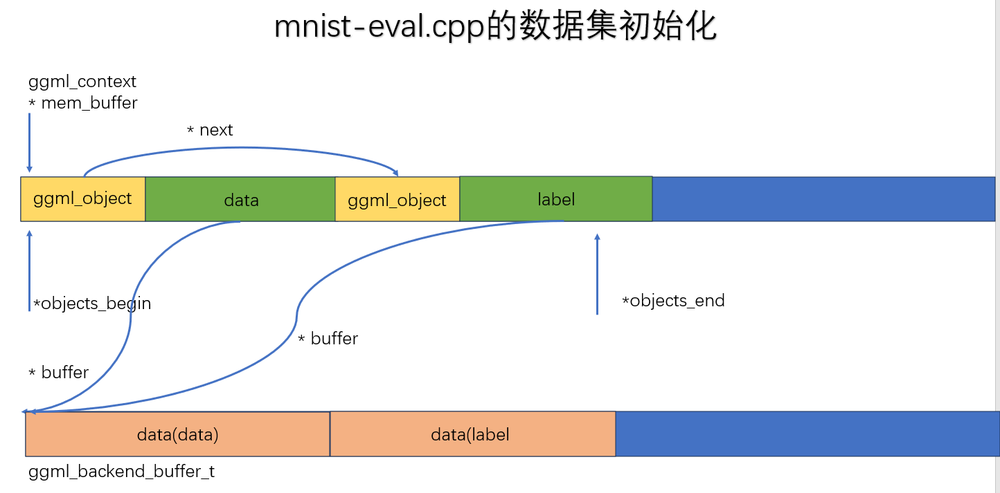
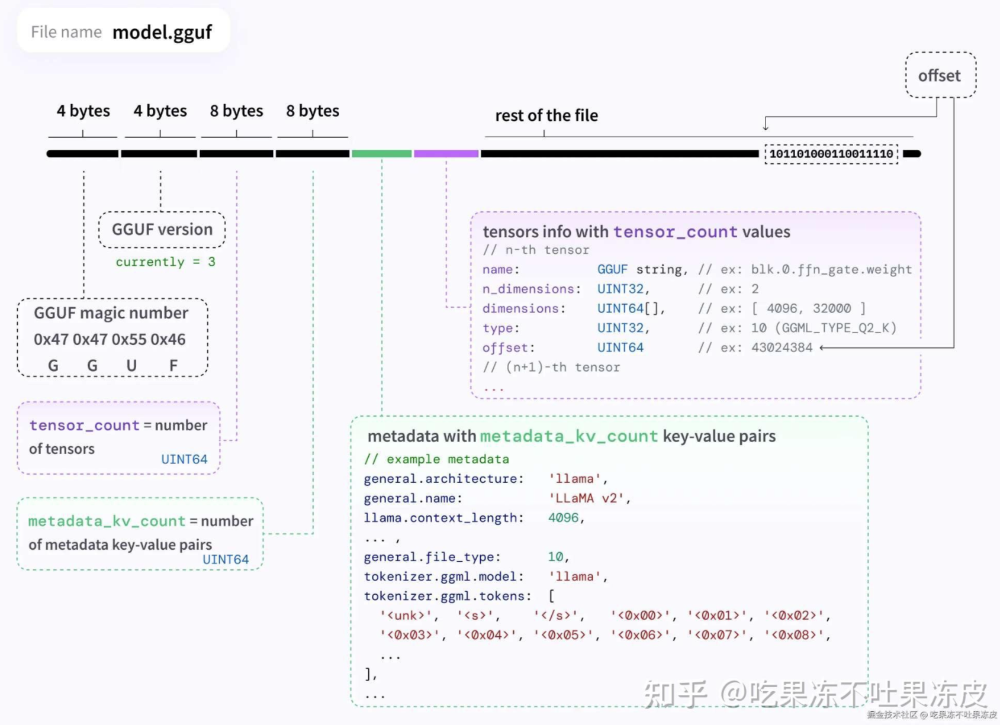

[TOC]

# 源码解读

## 核心数据结构

### ggml_object

```c
struct ggml_object {
    size_t offs;
    size_t size;

    struct ggml_object * next;

    enum ggml_object_type type;

    char padding[4];
};
```

`offs`：这个object的**数据**在`mem_buffer`中的字节偏移量，为什么会有32的偏移，object这个结构体相当于一个头，这个头是占了32个字节。
`size`：这个object占用的字节数
`next`：单向链表，指向的下一个object
`type`：枚举类型，主要有三种`TENSOR`、`GRAPH`和`WORK_BUFFER`

这里的`ggml_object`本身也存在ctx的`mem_buffer`里

### ggml_context

ggml_context是一个上下文管理结构体

```c
struct ggml_context {
    size_t mem_size;
    void * mem_buffer;
    bool   mem_buffer_owned;
    bool   no_alloc;

    int    n_objects;

    struct ggml_object * objects_begin;
    struct ggml_object * objects_end;
};
```
ggml_context本质是一个线性内存池的管理器，这里面称为`arena allocator`，是一个控制头。

`mem_size`：是表示内存池的总大小（多少个字节），表示的是`mem_buffer`这片大内存的总容量上限

`mem_buffer`：是这块大内存的起始地址，一大块连续大内存，这块内存存放的是：`ggml_object`、`ggml_tensor`等等

`mem_buffer_owned`：这块内存是不是该ctx拥有的，如果说我声明一个ctx，没有给他分配内存，是ctx自己malloc的，那就有拥有权，如果指定了一个地址，那就没有拥有权。**拥有权在于允不允许ggml来释放**

`no_alloc`：如果是false，表示新建张量的时候，tensor的元数据+数据本身都分配在mem_buffer中，如果是true，那就是只在mem_buffer中存ggml_tensor的结构体，数据部分不去分配，数据可能要分配到后端上（目前是这样）

`n_object`：整个ctx就是一个链表，这个就是链表节点数

`objects_begin`：链表头节点

`objects_end`：链表尾节点


#### 理解整个ctx


如果不进行alloc，那整个ctx保留的就是元数据，这种方式让实际数据的存储与后端剥离开，不会先分配到内存中

### ggml_tensor

```c
struct ggml_tensor {
    enum ggml_type type;

    struct ggml_backend_buffer * buffer;

    int64_t ne[GGML_MAX_DIMS]; // number of elements
    size_t  nb[GGML_MAX_DIMS]; // stride in bytes:
                                // nb[0] = ggml_type_size(type)
                                // nb[1] = nb[0]   * (ne[0] / ggml_blck_size(type)) + padding
                                // nb[i] = nb[i-1] * ne[i-1]

    // compute data
    enum ggml_op op;

    // op params - allocated as int32_t for alignment
    int32_t op_params[GGML_MAX_OP_PARAMS / sizeof(int32_t)];

    int32_t flags;

    struct ggml_tensor * src[GGML_MAX_SRC];

    // source tensor and offset for views
    struct ggml_tensor * view_src;
    size_t               view_offs;

    void * data;

    char name[GGML_MAX_NAME];

    void * extra; // extra things e.g. for ggml-cuda.cu

    char padding[8];
};
```

`type`：指的是数据的元素类型，决定的是每个元素占用多少字节
`buffer`：tensor指向的后端存储区
`ne`：number of element，指的是形状（一般是列、行，第三维，第四维）
`nb`：number of Bytes，每个维度存多少个字节，这个是方便stride的，方便求地址用
`ggml_op`：就是算子类型
`op_params`：运算参数


### ggml_backend_buffer

这个就是把数据实际存储到了该后端上

```c
struct ggml_backend_buffer {
    struct ggml_backend_buffer_i  iface;
    ggml_backend_buffer_type_t    buft;
    void * context;
    size_t size;
    enum ggml_backend_buffer_usage usage;
};
```

`ggml_backend_buffer_i`：这里面保存的是虚函数表，是一组虚函数指针，去定义这块内存怎么读写，是为了适配不同后端（CPU/CUDA/Metal）填入不同的函数实现，上层的代码去统一调用

`buft`：记录自己是哪种类型的buffer，用来查询对齐要求、名称等元信息

`context`：后端私有数据

`size`：这块buffer的总字节数

`usage`：用途标记


#### ggml_backend_buffer_i

```c
struct ggml_backend_buffer_i {
    // 释放底层内存
    void         (*free_buffer)  (ggml_backend_buffer_t buffer);
    // 返回内存起始地址
    void *       (*get_base)     (ggml_backend_buffer_t buffer);
    // 将tensor注册到buffer
    enum ggml_status (*init_tensor)(ggml_backend_buffer_t buffer, struct ggml_tensor * tensor);
    // 对tensor数据区清零
    void         (*memset_tensor)(ggml_backend_buffer_t buffer, struct ggml_tensor * tensor, uint8_t value, size_t offset, size_t size);
    // 把CPU数据写入buffer
    void         (*set_tensor)   (ggml_backend_buffer_t buffer, struct ggml_tensor * tensor, const void * data, size_t offset, size_t size);
    // 从buffer读取数据返回cpu
    void         (*get_tensor)   (ggml_backend_buffer_t buffer, const struct ggml_tensor * tensor, void * data, size_t offset, size_t size);
    // (optional) 2d data copies
    void         (*set_tensor_2d)(...);
    void         (*get_tensor_2d)(...);
    // (optional) tensor copy between backends
    bool         (*cpy_tensor)   (ggml_backend_buffer_t buffer, const struct ggml_tensor * src, struct ggml_tensor * dst);
    // 整块buffer清零
    void         (*clear)        (ggml_backend_buffer_t buffer, uint8_t value);
    // (optional) reset any internal state
    void         (*reset)        (ggml_backend_buffer_t buffer);
};
```


#### 进一步理解



### ggml_opt_dataset

ggml_opt_dataset是最新版里面，用来初始化数据集的。

```c
struct ggml_opt_dataset {
    struct ggml_context   * ctx    = nullptr;
    ggml_backend_buffer_t   buf    = nullptr;
    struct ggml_tensor    * data   = nullptr;
    struct ggml_tensor    * labels = nullptr;

    int64_t ndata       = -1;
    int64_t ndata_shard = -1;
    size_t  nbs_data    = -1;
    size_t  nbs_labels  = -1;

    std::vector<int64_t> permutation;
};
```

`ggml_context`：内存池管理器
`ggml_backend_buffer_t`：后端存储
`ggml_tensor`：数据tensor
`ggml_tensor`：标签tensor


### mnist_model

对于mnist的demo来讲，这是一个关键的模型结构体

```c
struct mnist_model {
    std::string arch;   // "fc"或者"cnn"，决定是用哪套权重
    ggml_backend_sched_t backend_sched; // 后端调度器
    std::vector<ggml_backend_t> backends;   // 可用后端列表
    const int nbatch_logical;   // 逻辑batch_size，逻辑上来讲就是我们希望一次用多少个样本
    const int nbatch_physical;  // 物理batch_size，物理上就是实际硬件并行计算多少个样本

    struct ggml_tensor * images     = nullptr;  // 每次输入的一批图像tensor指针
    struct ggml_tensor * logits     = nullptr;  // 模型输出的得分指针

    // 权重信息
    struct ggml_tensor * fc1_weight = nullptr;  
    struct ggml_tensor * fc1_bias   = nullptr;
    struct ggml_tensor * fc2_weight = nullptr;
    struct ggml_tensor * fc2_bias   = nullptr;

    // 这个是如果使用cnn来推理，那就是这套指针
    struct ggml_tensor * conv1_kernel = nullptr;
    struct ggml_tensor * conv1_bias   = nullptr;
    struct ggml_tensor * conv2_kernel = nullptr;
    struct ggml_tensor * conv2_bias   = nullptr;
    struct ggml_tensor * dense_weight = nullptr;
    struct ggml_tensor * dense_bias   = nullptr;

    // 重要的上下文管理
    struct ggml_context * ctx_gguf    = nullptr;        // 权重上下文管理
    struct ggml_context * ctx_static  = nullptr;        // 存储静态权重tensor的元数据
    struct ggml_context * ctx_compute = nullptr;        // 存计算图中间节点
    ggml_backend_buffer_t buf_gguf    = nullptr;        // ctx_gguf对应的后端存储
    ggml_backend_buffer_t buf_static  = nullptr;        // ctx_static的后端存储
```

### gguf_context

```c
struct gguf_context {
    uint32_t version = GGUF_VERSION;

    std::vector<struct gguf_kv> kv;
    std::vector<struct gguf_tensor_info> info;

    size_t alignment = GGUF_DEFAULT_ALIGNMENT;
    size_t offset    = 0; // offset of `data` from beginning of file
    size_t size      = 0; // size of `data` in bytes

    void * data = nullptr;
};
```



n_kv n_tensors 学习一下gguf的具体格式

### ggml_backend_reg

```cpp
struct ggml_backend_reg {
    int api_version; // initialize to GGML_BACKEND_API_VERSION
    struct ggml_backend_reg_i iface;
    void * context;
};
```

这应该是一个标明后端的结构，主要是声明后端的一些情况，有一些虚函数可以使用

### ggml_backend_device

```cpp
struct ggml_backend_device {
    struct ggml_backend_device_i iface;
    ggml_backend_reg_t reg;
    void * context;
};
```

device也是同理的，我们有很多device的接口，它对应的reg的地址，也就是跟ggml_backend_reg对应起来的，再一个就是context

```cpp
struct ggml_backend_device_i {
        // device name: short identifier for this device, such as "CPU" or "CUDA0"
        const char * (*get_name)(ggml_backend_dev_t dev);

        // device description: short informative description of the device, could be the model name
        const char * (*get_description)(ggml_backend_dev_t dev);

        // device memory in bytes: 0 bytes to indicate no memory to report
        void         (*get_memory)(ggml_backend_dev_t dev, size_t * free, size_t * total);

        // device type
        enum ggml_backend_dev_type (*get_type)(ggml_backend_dev_t dev);

        // device properties
        void (*get_props)(ggml_backend_dev_t dev, struct ggml_backend_dev_props * props);

        // backend (stream) initialization
        ggml_backend_t (*init_backend)(ggml_backend_dev_t dev, const char * params);

        // preferred buffer type
        ggml_backend_buffer_type_t (*get_buffer_type)(ggml_backend_dev_t dev);

        // (optional) host buffer type (in system memory, typically this is a pinned memory buffer for faster transfers between host and device)
        ggml_backend_buffer_type_t (*get_host_buffer_type)(ggml_backend_dev_t dev);

        // (optional) buffer from pointer: create a buffer from a host pointer (useful for memory mapped models and importing data from other libraries)
        ggml_backend_buffer_t (*buffer_from_host_ptr)(ggml_backend_dev_t dev, void * ptr, size_t size, size_t max_tensor_size);

        // check if the backend can compute an operation
        bool (*supports_op)(ggml_backend_dev_t dev, const struct ggml_tensor * op);

        // check if the backend can use tensors allocated in a buffer type
        bool (*supports_buft)(ggml_backend_dev_t dev, ggml_backend_buffer_type_t buft);

        // (optional) check if the backend wants to run an operation, even if the weights are allocated in an incompatible buffer
        // these should be expensive operations that may benefit from running on this backend instead of the CPU backend
        bool (*offload_op)(ggml_backend_dev_t dev, const struct ggml_tensor * op);

        // (optional) event synchronization
        ggml_backend_event_t (*event_new)         (ggml_backend_dev_t dev);
        void                 (*event_free)        (ggml_backend_dev_t dev, ggml_backend_event_t event);
        void                 (*event_synchronize) (ggml_backend_dev_t dev, ggml_backend_event_t event);
    };
```

这张虚函数表还是很关键的，我们一层层来看

如果是以cpu为例，`ggml_backend_cpu_device_init_backend`返回的是cpu的init，这就是具体的函数了，用虚函数表来实现运行时的多态


### ggml_backend_cpu_context

```cpp
struct ggml_backend_cpu_context {
    int                 n_threads;
    ggml_threadpool_t   threadpool;

    uint8_t *           work_data;
    size_t              work_size;

    ggml_abort_callback abort_callback;
    void *              abort_callback_data;

    bool                use_ref;  // use reference implementation
};
```

这是cpu后端的上下文类，我们这里主要声明线程数量、线程池、数据、数据量

GGML_DEFAULT_N_THREADS的默认线程数量是4

### ggml_backend

```cpp
struct ggml_backend {
    ggml_guid_t guid;
    struct ggml_backend_i iface;
    ggml_backend_dev_t device;
    void * context;
};
```

### ggml_backend_sched

```cpp
struct ggml_backend_sched {
    bool is_reset; // true if the scheduler has been reset since the last graph split
    bool is_alloc;

    int n_backends;

    ggml_backend_t backends[GGML_SCHED_MAX_BACKENDS];
    ggml_backend_buffer_type_t bufts[GGML_SCHED_MAX_BACKENDS];
    ggml_gallocr_t galloc;

    // hash map of the nodes in the graph
    struct ggml_hash_set  hash_set;
    int                 * hv_tensor_backend_ids; // [hash_set.size]
    struct ggml_tensor ** hv_tensor_copies;      // [hash_set.size][n_backends][n_copies]

    int * node_backend_ids; // [graph_size]
    int * leaf_backend_ids; // [graph_size]

    int * prev_node_backend_ids; // [graph_size]
    int * prev_leaf_backend_ids; // [graph_size]

    // copy of the graph with modified inputs
    struct ggml_cgraph graph;

    // graph splits
    struct ggml_backend_sched_split * splits;
    int n_splits;
    int splits_capacity;

    // pipeline parallelism support
    int n_copies;
    int cur_copy;
    int next_copy;
    ggml_backend_event_t events[GGML_SCHED_MAX_BACKENDS][GGML_SCHED_MAX_COPIES];
    struct ggml_tensor * graph_inputs[GGML_SCHED_MAX_SPLIT_INPUTS];
    int n_graph_inputs;

    struct ggml_context * ctx;

    ggml_backend_sched_eval_callback callback_eval;
    void * callback_eval_user_data;

    char * context_buffer;
    size_t context_buffer_size;

    bool op_offload;

    int debug;

    // used for debugging graph reallocations [GGML_SCHED_DEBUG_REALLOC]
    // ref: https://github.com/ggml-org/llama.cpp/pull/17617
    int debug_realloc;
    int debug_graph_size;
    int debug_prev_graph_size;
};

```

## 数据集构建

### ggml_init

首先就是走`ggml_opt_dataset_init`这个函数，进行初始化，这里上来是一个参数的初始化，也就是ggml_init_params params = {}; 这里为什么是`ggml_tensor_overhead()`，看到这个里面就是返回两个结构体的元数据大小，也就是`ggml_object`的size，是32，`ggml_tensor`的size，是336。乘以二刚好就是输入数据和数据标签两个ggml_object的大小，把这个参数送到ggml_init进行初始化。
```cpp
    ggml_opt_dataset_t result = new ggml_opt_dataset;
    result->ndata       = ndata;
    result->ndata_shard = ndata_shard;

    {
        struct ggml_init_params params = {
            /*.mem_size   =*/ 2*ggml_tensor_overhead(),
            /*.mem_buffer =*/ nullptr,
            /*.no_alloc   =*/ true,
        };
        result->ctx = ggml_init(params);
    }

```

往下来底层走的是一个`ggml_malloc`，sizeof(ctx)是40。

`GGML_PAD(params.mem_size, GGML_MEM_ALIGN)`会进行一个内存对齐的内存申请，这块就是申请两个`ggml_object` + `ggml_tensor`的结构体，因为我们是no_alloc的，所以不会在ctx中保存数据信息

这样context这个数据结构就定义好了，下一步是生成具体的tensor结构体。

### ggml_new_tensor_impl

这个很好理解，就是去把具体的ctx中的obj和tensor定义好，但是这一步仅仅是声明了元数据，包括tensor的ne、nb，维护好了ctx这个链表，但是具体的数据buf还没有维护好

### ggml_backend_alloc_ctx_tensors_from_buft

这个是分配到具体后端上的内存

## 模型构建

在模型构建过程中我们维护第二个`gguf_context`

## 计算图构建

### 矩阵乘法算子构建

```c
struct ggml_tensor * ggml_mul_mat(
        struct ggml_context * ctx,
        struct ggml_tensor  * a,
        struct ggml_tensor  * b) {
    GGML_ASSERT(ggml_can_mul_mat(a, b));
    GGML_ASSERT(!ggml_is_transposed(a));

    const int64_t ne[4] = { a->ne[1], b->ne[1], b->ne[2], b->ne[3] };
    struct ggml_tensor * result = ggml_new_tensor(ctx, GGML_TYPE_F32, 4, ne);

    result->op     = GGML_OP_MUL_MAT;
    result->src[0] = a;
    result->src[1] = b;

    return result;
}
```

## 模型推理

